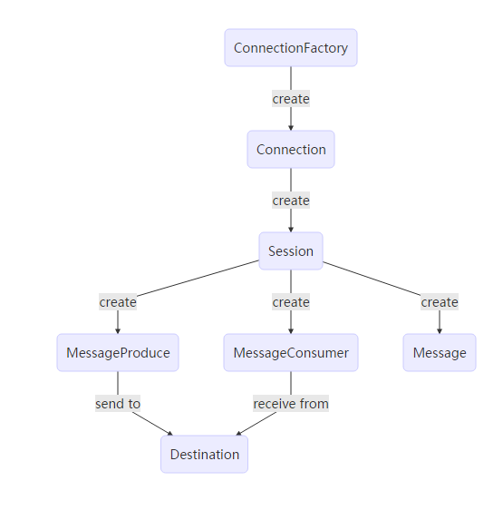

# JMS规范

## JMS 相关概念

1. [消费者/订阅者: 接受并处理消息的客户端](#subscribe)
2. [消息: 应用程序之间传递的数据内容](#message)
3. [消息模式: 在客户端之间传递消息的方式,JMS中定义了主题和队列两种模式](#mode)
4. [JMS编码接口](#encode)
5. [JMS编码接口之间的关系](#relation)  
---

<h3 id="subscribe">消费者/订阅者</h3>
略
<h3 id="message">消息</h3>
略
<h3 id="mode">消息模式</h3>
1. 队列模式
    1. 客户端包括生产者和消费者
    2. 队列中的消息只能被一个消费者消费
    3. 消费者可以随时消费队列中的消息
2. 主题模式
    1. 客户端包括发布者和订阅者
    2. 主题中的消息被所有订阅者消费
    3. 消费者不能消费订阅之前就发送到主题的消息

<h3 id="encode">编码接口</h3>
1. ConnectionFactory 用于创建连接到消息中间件的连接工厂
2. Connection 代表了应用程序和消息服务器之间的通信链路
3. Destination 消息发布和接受的地点,包括队列或主题
4. Session 表示一个单线程的上下文,用于发送和接收消息
5. MessageConsumer 有会发创建,用于接受发送到目标的消息
6. MessageProduce 由会话创建,用于发送消息到目标
7. Message 在消费者和生产者之间传送的对象,消息头,一组消息属性,一个消息体  

<h3 id="relation">***JMS编码接口之间的关系***</h3>

[返回大纲](../0.大纲.md)
