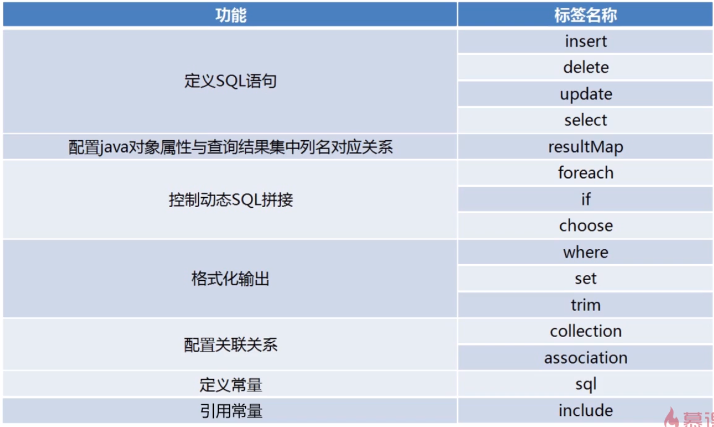

- [SqlSession](#sqlsession)
- [spring+mybatis](#springmybatis)
- [SQL动态拼接](#sql%E5%8A%A8%E6%80%81%E6%8B%BC%E6%8E%A5)
	- [参数传递:](#%E5%8F%82%E6%95%B0%E4%BC%A0%E9%80%92)
- [一对多映射](#%E4%B8%80%E5%AF%B9%E5%A4%9A%E6%98%A0%E5%B0%84)
- [xml标签](#xml%E6%A0%87%E7%AD%BE)
- [容易混淆的概念](#%E5%AE%B9%E6%98%93%E6%B7%B7%E6%B7%86%E7%9A%84%E6%A6%82%E5%BF%B5)

## SqlSession

**作用:**
1. 向SQL语句传入参数
2. 执行SQL语句
3. 获取执行SQL语句的结果
4. 事务的控制

**如何得到SqlSession:**
1. 传统方法
    1. 通过配置文件获取数据库连接相关的信息
    2. 通过配置信息构建SqlSessionFactory
    3. 通过SqlSessionFactory获取构建SqlSession

    ```
        Reader reader = Resources.getResourceAsReader("org/apache/ibatis/submitted/stringlist/mybatis-config.xml");
        sqlSessionFactory = new SqlSessionFactoryBuilder().build(reader);
        SqlSession sqlSession = sqlSessionFactory.openSession();
    ```
2. spring+mybatis
    1. 在spring配置文件中创建DataSource实例
    2. 将dataSource作为属性注入到org.mybatis.spring.SqlSessionFactoryBean中(实现了initializingBean接口)
    3. SqlSessionFactoryBean中中注入属性mapperLocations,指定mapper.xml 文件路径
    4. spring自动 调用工厂类的getObject()创建SqlSessionFactory实例
    5. 操作数据库(编程式):  通过SqlSessionFactory.openSession()获取sqlsession实例
	6. 操作数据库(spring管理): 
		1. 实例化MapperScannerConfigure类,指定basepack,由spring启动时进行扫描指定报下的Mapper接口类,用于依赖注入;
		2. 在service中或者dao中 使用注解@autowired或者@resource Mapper ; spring自动进行注入根据xml配置文件生成的Mapper的代理实现类,直接调用mapper的方法.

    

## spring+mybatis

	配置文件配置详解:
	1. PropertyPlaceholderConfigurer 读取配置文件
	2. ComboPooledDataSource 根据配置文件中的值实例化数据源连接池
	3. SqlSessionFactoryBean根据DataSource和mapperLocation,configLocation实例化sqlSessionFactory
	4. 初始化MapperScannerConfigurer ,指定basepackage为mapper 接口类所在包路径,应用启动时由spring进行实例化,和依赖管理
	5. 在代码中加入 @autowired Mapper ,spring将根据xml文件创建的Mapper接口代理实现类进行注入,直接在代码中进行mapper.insert() 调用即可
	6. DataSourceTransactionManager 指定DataSource 开启事务管理
	7. 配置事务advice ,指定transcation-manager为DataSourceTransactionManager的实例
	8. 配置aop的pointcut 和advice (即:6中创建的)
   ```xml
    <?xml version="1.0" encoding="UTF-8"?>
	<beans xmlns="http://www.springframework.org/schema/beans"
		xmlns:xsi="http://www.w3.org/2001/XMLSchema-instance" xmlns:c="http://www.springframework.org/schema/context"
		xmlns:tx="http://www.springframework.org/schema/tx" xmlns:aop="http://www.springframework.org/schema/aop"
		xsi:schemaLocation="
			http://www.springframework.org/schema/tx http://www.springframework.org/schema/tx/spring-tx-3.1.xsd
			http://www.springframework.org/schema/context http://www.springframework.org/schema/context/spring-context-3.1.xsd
			http://www.springframework.org/schema/beans http://www.springframework.org/schema/beans/spring-beans-3.1.xsd
			http://www.springframework.org/schema/aop http://www.springframework.org/schema/aop/spring-aop-3.0.xsd">

		<!-- 初始化dbcp连接池 使用jdbc操作数据库 不是mybatis -->
		<bean id="JdbcDataSource"
			class="top.linjt.java_learning.jdbc.connection.DataSourceFactory"
			factory-method="createDataSource">
			<constructor-arg name="dirveClass"
				value="top.linjt.java_learning.jdbc.connection.DBCPUtil"></constructor-arg>
			<!-- dbcp的时候用的到 -->
			<constructor-arg name="configFile" value="/mybatis/dataSource/dbcp.properties"></constructor-arg>
		</bean>


		<!-- 	读取配置文件,使其他bean可以使用el 表达式获取值 -->
		<bean id="propertyConfigurer"
			class="org.springframework.beans.factory.config.PropertyPlaceholderConfigurer">
			<property name="locations">
				<list>
					<value>classpath:/mybatis/dataSource/c3p0.properties</value>
				</list>
			</property>
			<property name="fileEncoding">
				<value>UTF-8</value>
			</property>
		</bean>

		<!-- c3p0连接池, 通过读取配置文件加载参数 -->
		<bean id="dataSource" class="com.mchange.v2.c3p0.ComboPooledDataSource">
			<property name="driverClass" value="${c3p0.driverClass}"></property>
			<property name="jdbcUrl" value = "${c3p0.jdbcUrl}"></property>
			<property name="user" value = "${c3p0.user}" ></property>
			<property name="password" value = "${c3p0.password}"></property>
		</bean>

		<!-- 需要在容器的配置文件中配置JDNI content.xml server.xml 等  
		JDNI 对象会在服务器启动时初始化 当工厂类 org.springframework.jndi.JndiObjectFactoryBean 
			初始化时会调用 接口:InitializingBean 中的afterPropertiesSet方法初始化实例,
			然后通过调用 factroyBean 的 getObject() 获取到jndi的实例  -->
		<!-- 	<bean id="commonDataSource" class="org.springframework.jndi.JndiObjectFactoryBean"> -->
		<!-- 		<property name="jndiName"> -->
		<!-- 			<value>java:comp/env/weChat</value> -->
		<!-- 		</property> -->
		<!-- 	</bean> -->

		<bean id="sqlSessionFactory" class="org.mybatis.spring.SqlSessionFactoryBean">
			<!--<property name="dataSource" ref="commonDataSource" />-->
			<property name="dataSource" ref="dataSource" />
			<!-- mapper.xml 配置文件所在路径,不用再configuration.xml中配置mapper元素了 -->
			<property name="mapperLocations" value ="classpath:top/linjt/java_learning/mybatis/weChat/mapper/*.xml"></property>
			<!-- mybatis 配置文件 -->
			<property name="configLocation" value = "classpath:mybatis/configuration.xml"></property>
		</bean>
		
		<!-- 配置MapperScanner , 使spring在启动时扫描对应的mapper包下的映射文件,并注入到引用的地方,类似于Dao的注入  -->
		<bean id="scanner" class="org.mybatis.spring.mapper.MapperScannerConfigurer">
			<property name="basePackage" value ="top.linjt.java_learning.mybatis.weChat.mapper"></property>
		</bean>

		<!-- 	开启事务管理 -->
		<bean id="transactionManager" class="org.springframework.jdbc.datasource.DataSourceTransactionManager">
		<property name="dataSource" ref="dataSource" />
		</bean>
		<!-- 事务传播特性 -->
		<tx:advice id="txAdvice" transaction-manager="transactionManager">
			<tx:attributes>
				<tx:method name="test*" propagation="REQUIRED" read-only="false"
					rollback-for="java.lang.Exception" />
				<tx:method name="delete*" propagation="REQUIRED" read-only="false"
					rollback-for="java.lang.Exception" no-rollback-for="java.lang.RuntimeException" />
				<tx:method name="insert*" propagation="REQUIRED" read-only="false"
					rollback-for="java.lang.RuntimeException" />
				<tx:method name="update*" propagation="REQUIRED" read-only="false"
					rollback-for="java.lang.Exception" />
				<tx:method name="find*" propagation="SUPPORTS" />
				<tx:method name="get*" propagation="SUPPORTS" />
				<tx:method name="select*" propagation="SUPPORTS" />
			</tx:attributes>
		</tx:advice>
		<!--  aop-->
		<aop:config>
			<aop:pointcut id="pc"
				expression="execution(public * top.linjt.*..service.*.*(..))" /> <!--把事务控制在Service层 -->
			<aop:advisor pointcut-ref="pc" advice-ref="txAdvice" />
		</aop:config>
	</beans>

```
mybatis xml 配置文件

```xml
<!DOCTYPE configuration
	PUBLIC "-//mybatis.org//DTD Config 3.0//EN"
	"http://mybatis.org/dtd/mybatis-3-config.dtd">

<configuration>
<settings>
	<setting name="useGeneratedKeys" value="false"/>
	<setting name="useColumnLabel" value="true"/>
	<!-- 打印查询语句 -->
	<setting name="logImpl" value="STDOUT_LOGGING" />
</settings>

<typeAliases>
	<!-- 在这里自定义类的别名 -->
<!--     <typeAlias alias="UserAlias" type="org.apache.ibatis.submitted.complex_property.User"/> -->
</typeAliases>
</configuration>
```

JDNI配置
```xml
<Resource name="weChat" 
type="javax.sql.DataSource" 
auth="Container"
username="root" 
password="123" 
driverClassName="com.mysql.jdbc.Driver"
url="jdbc:mysql://localhost:3306/weChat"
maxIdle="40" maxWait="4000" maxActive="250"
factory="org.apache.tomcat.dbcp.dbcp.BasicDataSourceFactory" />
```

## SQL动态拼接


### 参数传递:


1. sqlSession 调用方法:

	```
		sqlSession.selectOne("get",id);
	```


	**问题**:如上面代码所示,调用selectOne只允许传一个参数,因此当需要传递多个参数时,会出现问题;  
	> **解决:**
	> 传递一个对象 使用ognl表达式获取值
2. 通过获取Mapper接口的代理实现并调用方法:

	1. 通过sqlSession调用getMapper方法获取mapper 实现类,每次调用都会创建新的对象
		```java
			MessageMapper messageMapper = sqlSession.getMapper(MessageMapper.class);
			messageMapper.get(id);
		```
	2. 在配置文件中开启MapperScannerConfigurer 扫描Mapper接口所在包,实现依赖注入
	```java
	
	//interface
	public interface MessageMapper{
		//传递单个参数
		MessageBean get(int id );
		//传递多个参数 通过@Param 指定参数的名称,这样就可以在xml文件中直接使用该名称获取参数,
		//如果不使用param指定名称则用 索引获取,(不推荐,因为在需要对参数进行非空判断时报错,不会0.0)
		List<MessageBean> query(@Param("command")String command,@Param("description")String description) throws SQLException;
		//通过对象进行传递,在xml中配置parameterType 指定参数类型, 以属性名获取参数,具体取值方式参考mybatis对ognl的扩展
		void insert(MessageBean message);
	}
	 @Autowired
	private MessageMapper messageMapper;
	
	messageMapper.get(id);

	messageMapper.query(command, description);

	messageMapper.insert(message);
	```

	mapper.xml
	```xml
	<mapper namespace="top.linjt.java_learning.mybatis.weChat.mapper.MessageMapper" >

		<select id="get" resultType="top.linjt.java_learning.mybatis.weChat.pojo.MessageBean"  parameterType="int">
			select * from message where id=#{id}
		</select>
		
		<select id="list" resultType="top.linjt.java_learning.mybatis.weChat.pojo.MessageBean">
			select * from message 
		</select>

		<select id="query"  resultType="top.linjt.java_learning.mybatis.weChat.pojo.MessageBean">
			select * from message  where 1=1 
			<if test="command !=null and command != '' ">
				and command like '%' #{command} '%'
			</if>
			<!-- 支持java的操作符 && ;甚至可以直接调用java的代码; 但是 部分特殊符号需要进行转义,与html方式相同 -->
 	 		<if test="description!=null &amp;&amp; !&quot;&quot;.equals(description.trim) ">
				and description= #{description}
			</if>
		</select>
		
		<insert id="insert" parameterType="top.linjt.java_learning.mybatis.weChat.pojo.MessageBean">
			insert into message (command,description,content) values (#{command},#{description},#{content})
		</insert>
	</mapper>
	```

## 一对多映射

	
通过在xml文件中配置resultMap,通过<collection>,<association> 等标签来映射一对多,一对一 的,并使用 select属性实现的嵌套查询  或者ofType属性实现结果映射,或者使用resultMap使用其他已定义的resultMap  
[点这里: 官网文档](http://www.mybatis.org/mybatis-3/zh/sqlmap-xml.html#Result_Maps)

自己写的:
```xml
<mapper namespace="top.linjt.java_learning.mybatis.weChat.mapper.CommandMapper" >

	<resultMap type="top.linjt.java_learning.mybatis.weChat.pojo.CommandBean" id="Command">
		<id column="command_id" jdbcType="INTEGER" property="id"/>
		<result column="name"  jdbcType="VARCHAR" property="name"/>
		<result column="description" jdbcType="VARCHAR" property="description"/>
		<collection property="contentList" resultMap="top.linjt.java_learning.mybatis.weChat.mapper.CommandContentMapper.CommandContent" ></collection>
	</resultMap>
	
	<select id="queryCommandList" resultMap="Command">
		select  
		a.id command_id,
		a.name name,
		a.description description,
		b.id id ,
		b.commandId commandId,
		b.content content
		   from command a left outer join command_content b on a.id =b.commandId 
		<where>
			<if test="command !=null and !&quot;&quot;.equals(command.trim())">
				command like '%' #{command} '%'
			</if>
			<if test="description !=null and !&quot;&quot;.equals(description.trim())">
				and description like '%' #{description} '%'
			</if>
		</where>
	</select>
</mapper>

<mapper namespace="top.linjt.java_learning.mybatis.weChat.mapper.CommandContentMapper" >

	<resultMap type="top.linjt.java_learning.mybatis.weChat.pojo.CommandContentBean" id="CommandContent">
		<id column="id" jdbcType="INTEGER" property="id"/>
		<result column="commandId"  jdbcType="INTEGER" property="commandId"/>
		<result column="content" jdbcType="VARCHAR" property="content"/>
	</resultMap>
</mapper>
```

## xml标签


## 容易混淆的概念

resultMap|resultType
---|---
在xml中配置|java类,通过mybatis自动装配

---
parameterMap|parameterType
---|---
在xml中配置|java类,通过mybatis自动装配
---
**#{}**|**${}**
---|---
mybatis处理时将#{}替换为 ? ,通过jdbc预编译 ,并设置参数,不需要手动添加''|没有预编译效果,直接 用变量值替换对应的${},需要手动填写''
可以防止sql注入|应用场景: select * from message order by 列名; 当列名为变量时,就要用到${} 了
---
**xml获取参数的方式**
parameterType|取值写法|是否可行
---|---|---
String或者基本数据类型|#{_parameter}|√
 &nbsp;|#{随便什么}|√(不推荐,最好规范些)
 &nbsp;|ognl:_parameter|√
 &nbsp;|ognl:随便什么|×
 自定义类型(例:Message)|#{随便什么}|x(必须写属性名)
---
---

insert对象时如果使用通过数据库自动生成主键的话,若需要获取插入对象的主键值,
需要设置 <code>useGeneratedKeys="true" keyProperty="id"</code>  
&nbsp;|&nbsp;
---|---
useGeneratedKeys|（仅对 insert 和 update 有用）这会令 MyBatis 使用 JDBC 的 getGeneratedKeys 方法来取出由数据库内部生成的主键（比如：像 MySQL 和 SQL Server 这样的关系数据库管理系统的自动递增字段），默认值：false。
keyProperty	|（仅对 insert 和 update 有用）唯一标记一个属性，MyBatis 会通过 getGeneratedKeys 的返回值或者通过 insert 语句的 selectKey 子元素设置它的键值，默认：unset。如果希望得到多个生成的列，也可以是逗号分隔的属性名称列表。
keyColumn	|（仅对 insert 和 update 有用）通过生成的键值设置表中的列名，这个设置仅在某些数据库（像 PostgreSQL）是必须的，当主键列不是表中的第一列的时候需要设置。如果希望得到多个生成的列，也可以是逗号分隔的属性名称列表。

 ```xml
 <insert id="insert" useGeneratedKeys="true" keyProperty="id" parameterType="top.linjt.java_learning.mybatis.weChat.pojo.MessageBean">
  	insert into message (command,description,content) values (#{command},#{description},#{content})
  </insert>
```